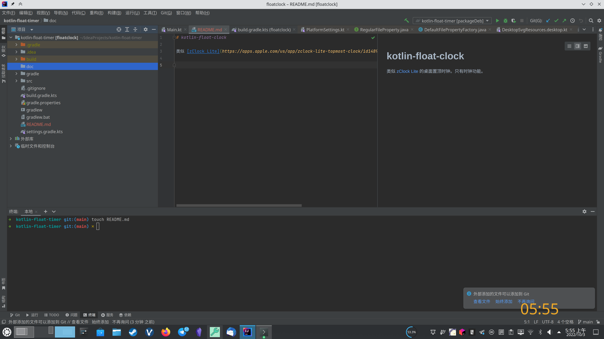

# floatclock

类似 [zClock Lite](https://apps.apple.com/us/app/zclock-lite-topmost-clock/id1489475245?mt=12) 的桌面置顶时钟。只有时钟功能。

一直很喜欢 macOS 下的应用 zClock，能清楚地提醒我当前时间，掌握摸鱼节奏。

目前暂时不会自动加开机启动，因为适配起来有点麻烦。反正这对你来说不难吧。

## 支持功能

- 时间显示
- 随机颜色 / 预设颜色
- 数码管风格主题 / 普通字体主题（右键菜单切换）
- 颜色与主题配置持久化

## 支持系统

- macOS
- Linux（KUbuntu 22.04、deepin 20.3 等）
- Windows 11

macOS 下支持多显示器，并可显示在其他应用的全屏 Space 之上。

## 存储

程序配置放在用户目录的标准配置位置：

- macOS：`~/Library/Application Support/floatclock/theme.json`
- Linux：`$XDG_CONFIG_HOME/floatclock/theme.json`（默认 `~/.config/floatclock/theme.json`）
- Windows：`%APPDATA%\floatclock\theme.json`

配置文件是 Jetpack DataStore 序列化的 JSON（`theme.json`），保存颜色 RGB 与当前主题样式（`digital` / `normal`）。

## 致谢

本项目参考或使用了以下项目或其中的一部分。

- [Compose Multiplatform](https://github.com/JetBrains/compose-multiplatform)
- [Jetpack DataStore (Okio)](https://developer.android.com/topic/libraries/architecture/datastore)
- [digital-7 字体](https://www.dafont.com/digital-7.font)
- [misc](https://github.com/jjYBdx4IL/misc)
