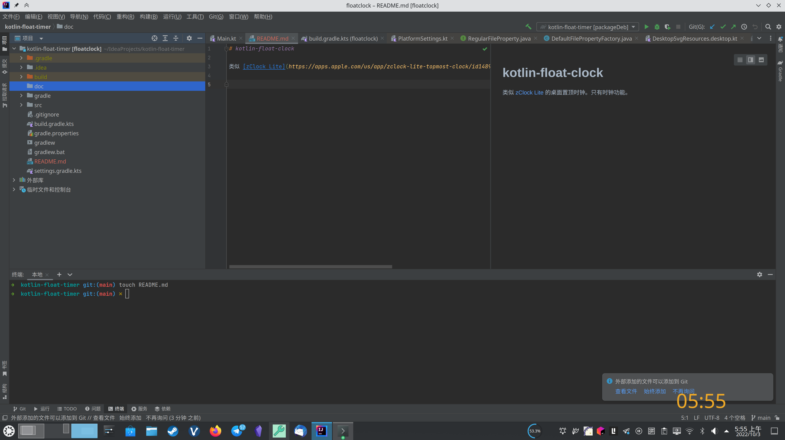

# floatclock

类似 [zClock Lite](https://apps.apple.com/us/app/zclock-lite-topmost-clock/id1489475245?mt=12) 的桌面置顶时钟。只有时钟功能。

一直很喜欢 macOS 下的应用 zClock，能清楚地提醒我当前时间，掌握摸鱼节奏。

支持 macOS、Windows、Linux 三个平台的开机启动（右键菜单切换）。

## 支持功能

- 时间显示
- 随机颜色 / 预设颜色（右键菜单，双击悬浮窗随机切换前景色）
- 数码管风格主题 / 普通字体主题（右键菜单切换）
- 颜色与主题配置持久化

## 支持系统

- macOS
- Linux（KUbuntu 22.04、deepin 20.3 等）
- Windows 11

macOS 下支持多显示器，并可显示在其他应用的全屏 Space 之上。

## 存储

程序配置放在用户目录的标准配置位置：

- macOS：`~/Library/Application Support/floatclock/theme.json`
- Linux：`$XDG_CONFIG_HOME/floatclock/theme.json`（默认 `~/.config/floatclock/theme.json`）
- Windows：`%APPDATA%\floatclock\theme.json`

配置文件是 Jetpack DataStore 序列化的 JSON（`theme.json`），保存颜色 RGB 与当前主题样式（`digital` / `normal`）。

## 致谢

本项目参考或使用了以下项目与资源。

- [Compose Multiplatform](https://github.com/JetBrains/compose-multiplatform)：构建桌面界面、悬浮时钟窗口与交互。
- [Jetpack DataStore (Okio)](https://developer.android.com/topic/libraries/architecture/datastore)：持久化保存颜色、时钟样式等应用设置。
- [Kotlinx Coroutines](https://github.com/Kotlin/kotlinx.coroutines)：处理异步任务、状态流、定时刷新与 Swing 线程调度。
- [Kotlinx Serialization](https://github.com/Kotlin/kotlinx.serialization)：序列化应用设置，并解析中国色 JSON 数据。
- [OSHI](https://github.com/oshi/oshi)：读取网卡收发字节数，用于计算和显示实时网速。
- [SLF4J](https://www.slf4j.org/)：提供统一的应用日志 API。
- [Logback](https://logback.qos.ch/)：提供日志运行时实现，按配置输出应用日志。
- [digital-7 字体](https://www.dafont.com/digital-7.font)：提供数码管样式的时钟字体。
- [中国色](https://zhongguose.com/)：提供中国传统颜色数据，用于前景色菜单与随机换色。
- [zClock Lite](https://apps.apple.com/us/app/zclock-lite-topmost-clock/id1489475245?mt=12)：提供桌面置顶时钟的产品灵感。
